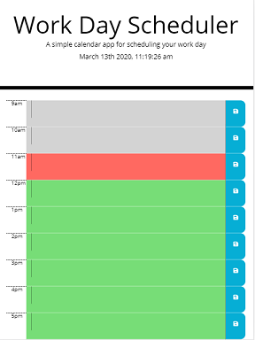

# Work-Day-Scheduler
Assignment 5

## Description
The task of this assignment was to create a work day schedular powered by jquery where the user could add events to a daily planner and save them to local storage.

The assignment criteria are:
* The current day displayed at the top of the calendar on opening
* Timeblocks for standard business hours
* Color coded timeblocks to indicate whether it is in the past, present, or future
* Being able to enter an event when clicking into a timeblock  
* When the save button for that timeblock is clicked, the text for that event is saved in local storage
* When the page is refreshed the events stay

## Installation
To install this project I flowed out what I needed to code.

The application was made using JQuery, Javascript, HTML, CSS, Bootstrap and the moment.js library to display the date and time. Font awesome was used for the save icon. Bootstrap was used to create responsive HTML. Javascript and JQuery creates the interactive onclick events and events are save as reminders to local storage. CSS was used to style the HTML.

## Usage
This has been deployed to the URLs 

* The URL of the deployed application is https://cazb67.github.io/work-day-scheduler/

* The URL of the GitHub repository is https://github.com/CazB67/work-day-scheduler

To use this work day schedular click on the link of the deployed application above. The user will be presented with this screen.

The red row captures the current hour time block. The grey rows capture the time blocks that have passed and the green time blocks capture future time blocks. The user inputs event into the text area then clicks on the save button in that row. The event is saved to local storage and when a new day arrives the event is cleared from local storage.

## Credits
* Team at UWA Coding Bootcamp
* Moment.js - https://momentjs.com/
* Bootstrap - https://getbootstrap.com/
* Font Awesome - https://fontawesome.com/

## License
MIT License

Copyright (c) [2020] [Caroline Bates]

Permission is hereby granted, free of charge, to any person obtaining a copy
of this software and associated documentation files (the "Software"), to deal
in the Software without restriction, including without limitation the rights
to use, copy, modify, merge, publish, distribute, sublicense, and/or sell
copies of the Software, and to permit persons to whom the Software is
furnished to do so, subject to the following conditions:

The above copyright notice and this permission notice shall be included in all
copies or substantial portions of the Software.

THE SOFTWARE IS PROVIDED "AS IS", WITHOUT WARRANTY OF ANY KIND, EXPRESS OR
IMPLIED, INCLUDING BUT NOT LIMITED TO THE WARRANTIES OF MERCHANTABILITY,
FITNESS FOR A PARTICULAR PURPOSE AND NONINFRINGEMENT. IN NO EVENT SHALL THE
AUTHORS OR COPYRIGHT HOLDERS BE LIABLE FOR ANY CLAIM, DAMAGES OR OTHER
LIABILITY, WHETHER IN AN ACTION OF CONTRACT, TORT OR OTHERWISE, ARISING FROM,
OUT OF OR IN CONNECTION WITH THE SOFTWARE OR THE USE OR OTHER DEALINGS IN THE
SOFTWARE.
